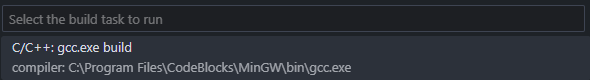

# Conway's Game of Life

Conway’s Game of Life consists of a grid of cells, each of which can be in one of two states: alive or dead. The game evolves in discrete steps, with the state of each cell being determined by a set of simple rules based on the states of its eight neighbors. The rules are:

- Any live cell with fewer than two live neighbors dies **(underpopulation).**
- Any live cell with two or three live neighbors lives on to the next generation.
- Any live cell with more than three live neighbors dies **(overpopulation).**
- Any dead cell with exactly three live neighbors becomes a live cell **(reproduction).**

These rules lead to complex and often unpredictable patterns emerging over time, making the Game of Life a fascinating example of cellular automata and emergent behavior

Relevant links: 

[Wikipedia](https://es.wikipedia.org/wiki/Juego_de_la_vida), [El juego de la vida de Conway (YouTube video)](https://www.youtube.com/watch?v=2ssnMkJFqbA)

## Setup

You can either open the ".cbp" file in Code::Blocks and compile the code directly from the IDE or:

in VSCode, from the main.c file, you can click on Terminal>Run Task...>"C/C++: gcc.exe build"

- _Note that you must set the gcc.exe file path in .vscode/tasks.json and install the following extension [C/C++ Compile Run](https://marketplace.visualstudio.com/items?itemName=danielpinto8zz6.c-cpp-compile-run)_